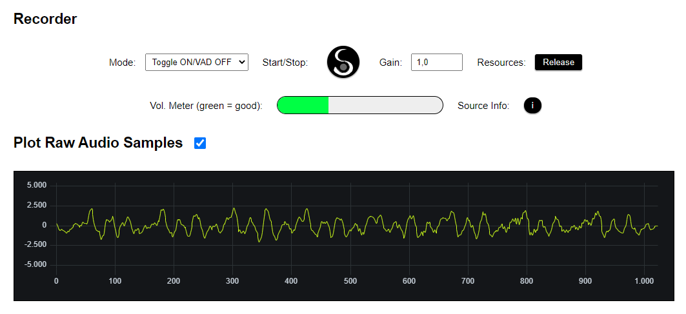

# SEPIA Web-Audio Library

Modular, cross-browser library to record and process audio using audio-worklets, web-workers and script-processors (as fallback).
Can be used to **chain different modules (worklets AND workers) to one audio pipeline**.   
  
The main focus of this library is speech recording and processing (see: [SEPIA Client app](https://github.com/SEPIA-Framework/sepia-html-client-app)),
but you can quickly add modules for many other use-cases as well (contributions welcome ^^).
  
Available modules:

- **Resampler** using Speex codec (WASM module)
- **Voice-Activity-Detection** (VAD) via WebRTC-VAD
- Custom SEPIA VAD module using Meyda to analyze bark-scale, **MFCC** and more
- **Wave Encoder** with lookback-buffer
- Porcupine **Wake-Word detector** (including: "Computer", "Jarvis", "Hey SEPIA" and more)
- [SEPIA STT Server](https://github.com/SEPIA-Framework/sepia-stt-server) WebSocket module for **speech recognition** (see STT Server for demo)
- more to come ...

## Quick-Start - Voice Recorder

<p align="center">
  
</p>

Efficiently resampling audio to 16000 Hz and creating 16Bit mono samples for speech recognition was one of the primary objectives when building this library.
While you can put together your own audio pipeline to do that (see below) there is a very convenient plugin available that does the job for you.
In this quick-start guide you will learn the basics to use the **'SepiaVoiceRecorder'**.  
  
The first step is to import the required files and set the correct path to the modules folder. You will find more details about this step in the tutorial below.
In this example the required files in 'modules' are `speex-resample-switch.js`, `wave-encoder-worker.js` and `shared/ring-buffer.min.js`:
```html
<script type="text/javascript" src="test/sepia-web-audio.min.js"></script>
<script type="text/javascript" src="test/sepia-recorder.min.js"></script>
<script>
    SepiaFW.webAudio.defaultProcessorOptions.moduleFolder = "test/modules";
</script>
```

Note that we chose to copy the minified core library (from 'dist'), the recorder plugin and the modules folder (from 'src') to a folder named 'test'.  
Now we can create our recorder:
```javascript
//catch some core events:
SepiaVoiceRecorder.onProcessorReady = console.log; 	//add your own handler here
SepiaVoiceRecorder.onProcessorInitError = console.error;

//events to process data:
SepiaVoiceRecorder.onResamplerData = function(data){
	//here you can process raw data, e.g.:
	//RMS volume: data.rms
	//Raw 16Bit mono buffer: data.samples[0]
}
SepiaVoiceRecorder.onWaveEncoderAudioData = function(waveData){
	//when we get encoded WAV data we can add it as audio element to our page:
	SepiaVoiceRecorder.addAudioElementToPage(document.body, waveData, "audio/wav");
}

//create the recorder:
SepiaVoiceRecorder.create({
	targetSampleRate: 16000,	//16kHz is actually the voice recorder default
	gain: 3.0, 					//we can amplify the signal using the gain option
	recordingLimitMs: 30000, 	//Total recording limit ms
});
```

Everything is prepared. To finally start recording you should wait for the ready event and then call:
```javascript
//to start:
SepiaVoiceRecorder.start();

//to stop:
SepiaVoiceRecorder.stop();
```

That's it :-).  
  
Of cause there are many more events, options and features available ^^. Please check out the [voice-recorder-demo.html](voice-recorder-demo.html) for a more complex recorder setup including VAD etc..


## Tutorial - Building Audio Pipelines

Full code for this tutorial can be found at: [tutorial-code-page.html](tutorial-code-page.html).  
Please check out the extensive [modules-demo.html](modules-demo.html) and the test pages for more examples.


### Part 1: Basic setup and single buffer module

#### Import library and modules

Copy `sepia-web-audio.js` to your project and import the library using the `<head>` section of your HTML page:

```html
<script type="text/javascript" src="src/sepia-web-audio.js"></script>
```

Copy the audio modules you are planning to use, for part 1 of the tutorial we only need 'buffer-switch.js'. When you're done set the correct path to your modules folder:

```html
<script>
    SepiaFW.webAudio.defaultProcessorOptions.moduleFolder = "src/modules";
</script>
```

Note: In this example we've used a folder called `src` for the library and modules folder but you can choose whatever you like.  
Note2: Currently there is no Javascript modules support yet. Feel free to create a request via the issues section if you need it ;-).

#### Create the audio processor

After importing the library you should see `SepiaFW.webAudio` in your scope. We have used this already in the head to set the modules folder. 
The `Processor` class is our main interface to handle the audio pipeline, but first we need to define the modules we want to use. 
Modules come in two main flavours, "switch" and "worker" with the main difference that switches are based on 'AudioWorklet' and can pass through data on a lower level (more details later).  
  
For this first example we only look at raw microphone data:

```javascript
var myModules = [];

function bufferCallback(data){
	//handle samples here using: data.samples
}
myModules.push({
	name: 'buffer-switch',
	settings: {
		onmessage: bufferCallback,
		options: {
			processorOptions: {
				bufferSize: 512, 	//size of samples generated
				passThroughMode: 0,	//0: none, 1: original (float32 array)
			}
		}
	}
});
```

After the module is set up we can create the processor:

```javascript
var processor = new SepiaFW.webAudio.Processor({
	onaudiostart: console.log,
	onaudioend: console.log,
	onrelease: console.log,
	onerror: console.error,
	modules: myModules
	
}, function(info){
	//Processor ready
	console.log(info); //Use 'info' to get details about source, sample-rate etc.
	
}, function(err){
	//Initialization error
	console.error(err);
});
```

#### Start, stop and release the processor

As soon as the ready event fired we can start processing with `processor.start()`, check `onaudiostart` (defined in processor options) and wait for data in `bufferCallback` (defined in module).  
  
After we're done we stop with `processor.stop()` and look out for `onaudioend`.  
  
If we don't want to restart later we can close the processor and clean up resources with `processor.release()`.


### Part 2: Resample input and record raw 16Bit PCM mono audio (WAV)

A very common use-case for this library is to resample microphone input and encode it as 16Bit PCM mono data (which is basically the default WAV file format).  
To make this happen we will replace the buffer module from earlier with a resampler and wave encoder module.
If you haven't done already please copy `speex-resample-switch.js`, `wave-encoder-worker.js` and `shared/ring-buffer.min.js` to your modules folder.  
  
NOTE: Some browsers are actually able to natively resampling for us ^^. The resampler module will simply skip transformation in this case but it might be preferable to prevent native resampling to retain full control over the quality and speed. 
`SepiaFW.webAudio.isNativeStreamResamplingSupported` will be 'true' when the lib is imported because we can't test for the feature but set to 'false' after the first failed attempt of native resampling!  
  
We create the resampler first and we use the "switch" version (not the "worker", this is preferred if 'AudioWorklet' is supported):

```javascript
SepiaFW.webAudio.tryNativeStreamResampling = false;		//global option (remain in control of resampling)

var myModules = [];
var targetSampleRate = 16000;	//this is the sample-rate we want
var bufferSize = 512;			//size of samples generated

function resamplerCallback(data){
	//data will include e.g.: data.samples and data.rms (volume)
}
var resampler = {
	name: 'speex-resample-switch',
	settings: {
		onmessage: resamplerCallback,
		sendToModules: [],	//[moduleIndex] - filled below with index of wave-encoder module
		options: {
			processorOptions: {
				targetSampleRate: targetSampleRate,
				bufferSize: bufferSize,
				resampleQuality: 5,			//1 (low quality) - 10 (best quality)
				calculateRmsVolume: true,	//the resampler can calculate RMS signal volume
				gain: 1.0,					//we can amplify the signal here
				passThroughMode: 0			//0: none - only switch in our pipe atm
			}
		}
	}
};
```

Next we create the wave-encoder module:

```javascript
function waveEncoderCallback(data){
	//can be used to track capture state and get final WAV
	//check: data.gate, data.output.wav, data.output.buffer
}
var waveEncoder = {
	name: 'wave-encoder',
	type: 'worker',
	handle: {},		//will be updated on init. with ref. to node.
	settings: {
		onmessage: waveEncoderCallback,
		options: {
			setup: {
				inputSampleRate: targetSampleRate,	//input of this will be ...
				inputSampleSize: bufferSize,		//... output of resampler
				lookbackBufferMs: 0,			//(experimental) ignore for now
				recordBufferLimitMs: 6000,		//we can apply recording limit as milliseconds
				//recordBufferLimitKb: 600,		//... or as kilobytes (default ~5MB)
				isFloat32: false	//resampler gives int16 - use e.g. for buffer module 
			}
		}
	}
};
```

Now we combine both modules to our audio pipeline. To tell the wave-encoder what input to use we combine the modules like this:

```javascript
myModules.push(resampler);		//index 1
myModules.push(waveEncoder);	//index 2

//connect resampler output to wave-encoder input:
resampler.settings.sendToModules.push(2);
```

We create the processor the same way as before (`var processor = new SepiaFW.webAudio.Processor({...});`) and call `processor.start()` when ready. 
The wave-encoder will receive data now but only start capturing when we explicitly tell it to using the module message interface. 
The same interface is used to request the captured data after we stop processing:

```javascript
//start recording
waveEncoder.handle.sendToModule({gate: "open"});

//wait some time then stop recording (this will trigger automatically after 'recordBufferLimitMs')
waveEncoder.handle.sendToModule({gate: "close"});

//finally get the data (this is possible until processor is released)
waveEncoder.handle.sendToModule({request: {get: "wave"}});		//encoded WAV
waveEncoder.handle.sendToModule({request: {get: "buffer"}});	//raw int16 buffer
```

Using the module interface an optimized 'waveEncoderCallback' (defined in module above) could look like this:

```javascript
//modified 'waveEncoderCallback':
function waveEncoderCallback(data){
	if (data.gate && data.gate.isOpen === false){
		//stop processor
		processor.stop();
		//get data
		waveEncoder.handle.sendToModule({request: {get: "wave"}});
		waveEncoder.handle.sendToModule({request: {get: "buffer"}});
	}
	if (data.output && data.output.wav){
		//just for fun, add WAV to page:
		var targetEle = document.body;
		var blobType = "audio/wav";
		SepiaFW.webAudio.addAudioElementToPage(targetEle, data.output.wav, blobType);
	}
}
```
  
... TO BE CONTINUED  

# Resources (see LICENSE as well)

* [AudioWorklet Polyfill](https://github.com/GoogleChromeLabs/audioworklet-polyfill)
* [GoogleChromeLabs AudioWorklet Design Patterns](https://github.com/GoogleChromeLabs/web-audio-samples/blob/gh-pages/audio-worklet/design-pattern/)
* [Mozilla WebRTC VAD](https://github.com/mozilla/webrtcvad_js)
* [Chromium VAD](https://chromium.googlesource.com/external/webrtc/+/refs/heads/lkgr/common_audio/vad/)
* [Meyda](https://github.com/meyda/meyda)
* [Node Speex Resampler](https://github.com/geekuillaume/node-speex-resampler)
* [pcm-convert](https://github.com/audiojs/pcm-convert)
* [uPlot Lazy Interface](https://github.com/bytemind-de/uPlot-lazy-interface)
* [Freesound.org](https://freesound.org/)