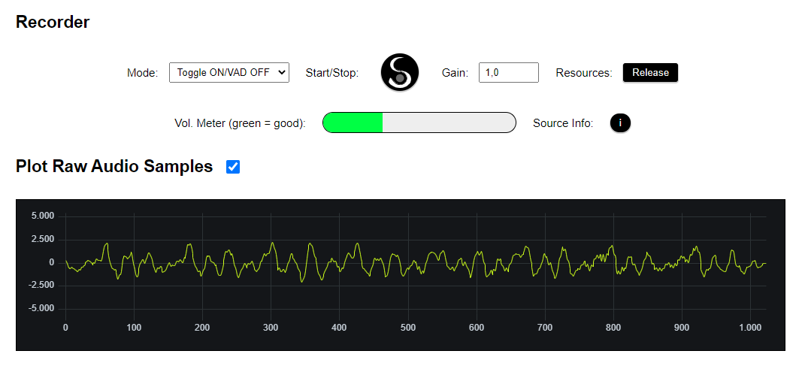

# SEPIA Web-Audio Library - Screenshots

## Microphone Settings and Modules Demo

  

## VAD with MFCC and Bark-Scale Plot (Visualized with [uPlot Lazy](https://github.com/bytemind-de/uPlot-lazy-interface))

  

## Voice Recorder Demo

  

